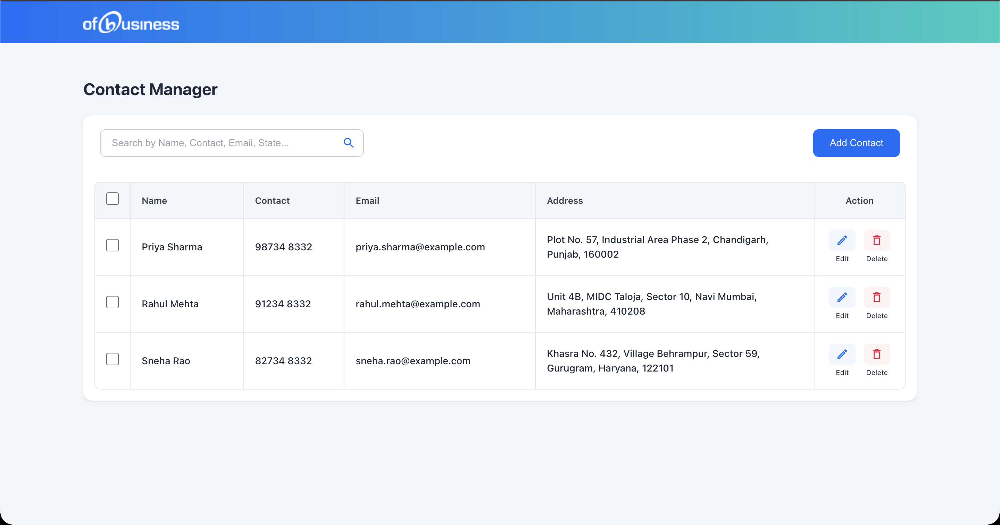
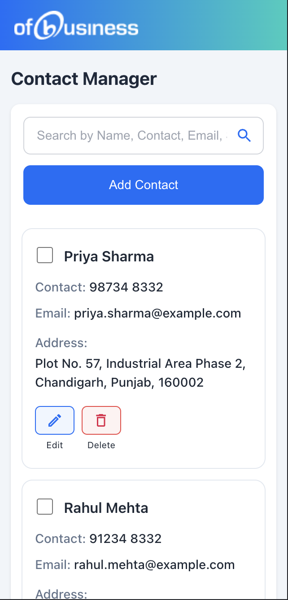
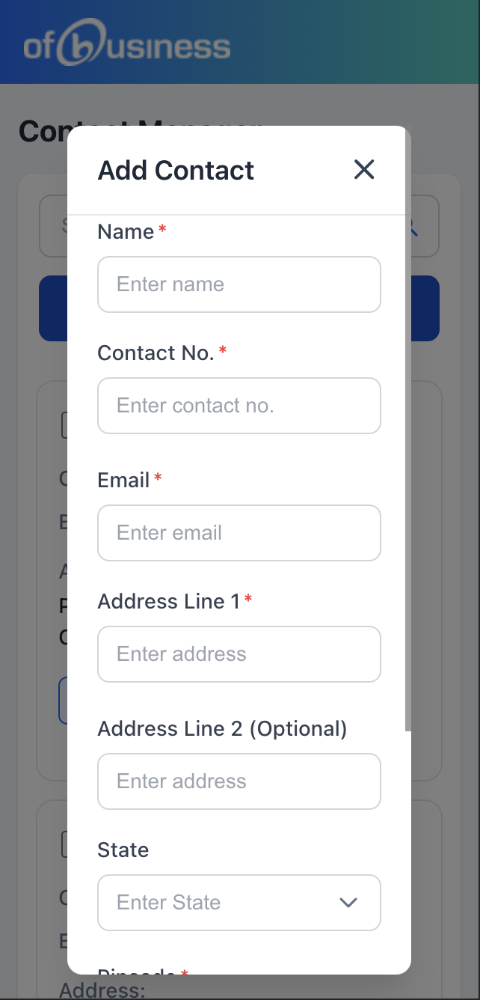

# Contact Manager

A functional Contact Manager application built with React, TypeScript, Redux Toolkit, and custom CSS.





## 🚀 Features

### Core Features
- **Display Contacts** - View all contacts in a clean table layout with Name, Email, Phone, and Address
- **Add Contact** - Add new contacts via a modal form with validation
- **Edit Contact** - Edit existing contacts with pre-filled form
- **Delete Contact** - Delete contacts with confirmation prompt
- **Search Contacts** - Real-time, case-insensitive search by name, email, phone, or state
- **Bulk Delete** - Select multiple contacts and delete them at once

### Additional Features
- **Toast Notifications** - Success/error feedback for all actions
- **localStorage Persistence** - Contacts are saved locally and persist across sessions
- **Responsive Design** - Works on desktop, tablet, and mobile devices
- **Form Validation** - Required field validation, email format, phone digits only, 6-digit pincode

## 🛠️ Tech Stack

- **Framework:** React 19 (functional components + hooks)
- **Language:** TypeScript
- **State Management:** Redux Toolkit
- **Styling:** Custom CSS (no UI libraries)
- **Build Tool:** Vite

## 📦 Installation

1. Clone the repository:
```bash
git clone <repository-url>
cd ofBusiness
```

2. Install dependencies:
```bash
npm install
```

3. Start the development server:
```bash
npm run dev
```

4. Open your browser and navigate to `http://localhost:5173`

## 📁 Project Structure

```
src/
├── components/
│   ├── ContactForm/      # Form for adding/editing contacts
│   ├── ContactTable/     # Main table displaying contacts
│   ├── DeleteConfirmModal/ # Delete confirmation dialog
│   ├── Header/           # App header with logo
│   ├── Modal/            # Reusable modal component
│   ├── SearchBar/        # Search input component
│   ├── Toast/            # Toast notification component
│   └── index.ts          # Component exports
├── store/
│   ├── contactsSlice.ts  # Redux slice for contacts state
│   ├── hooks.ts          # Typed Redux hooks
│   └── store.ts          # Redux store configuration
├── types/
│   └── contact.ts        # TypeScript interfaces
├── App.tsx               # Main application component
├── App.css               # Application styles
├── main.tsx              # Entry point
└── index.css             # Global styles
```

## 🎯 Validation Rules

| Field | Validation |
|-------|-----------|
| Name* | Required |
| Email* | Required, valid email format |
| Contact No. | Required, digits only |
| Address Line 1* | Required |
| Address Line 2 | Optional |
| State | Optional |
| Pincode* | Required, 6 digits |

## 📱 Responsive Breakpoints

- **Desktop:** > 900px - Full table view
- **Tablet:** 600px - 900px - Adjusted spacing, card view for contacts
- **Mobile:** < 600px - Stacked layout, full-width buttons

## 🎨 Design Implementation

The UI closely follows the provided Figma design with:
- Gradient header matching ofBusiness branding
- Clean white card containers
- Blue primary action buttons
- Red delete/danger buttons
- Proper spacing and typography
- Hover states and transitions


## 🔧 Scripts

- `npm run dev` - Start development server
- `npm run build` - Build for production
- `npm run lint` - Run ESLint
- `npm run preview` - Preview production build

## 📝 License

MIT
